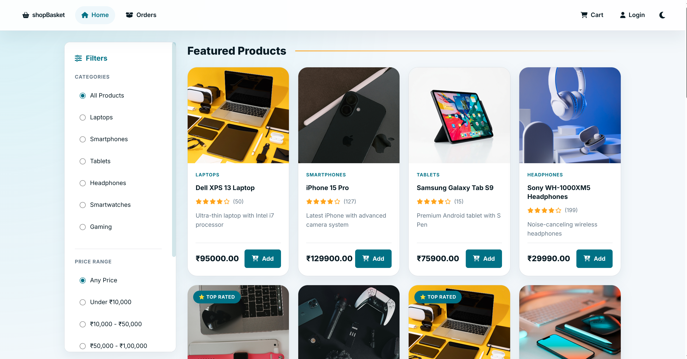
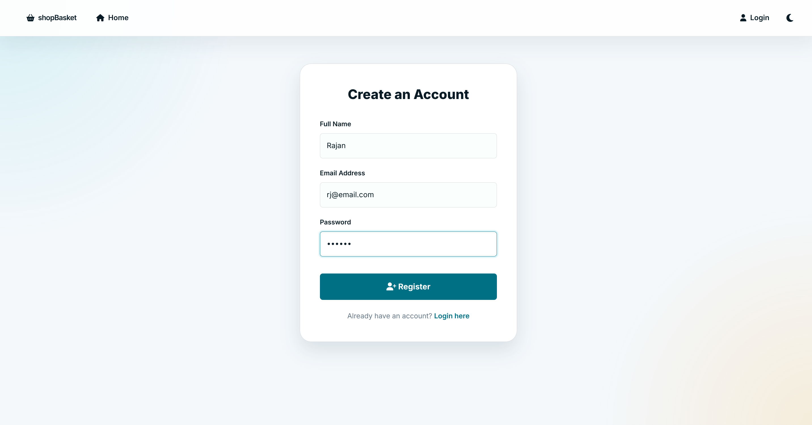
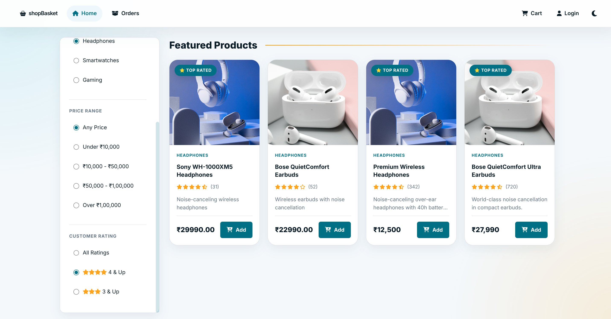
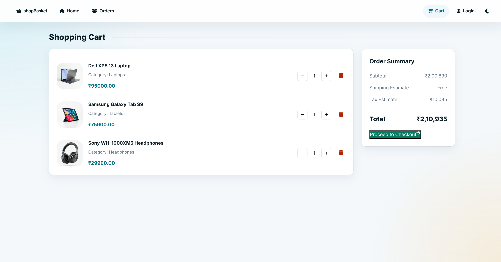
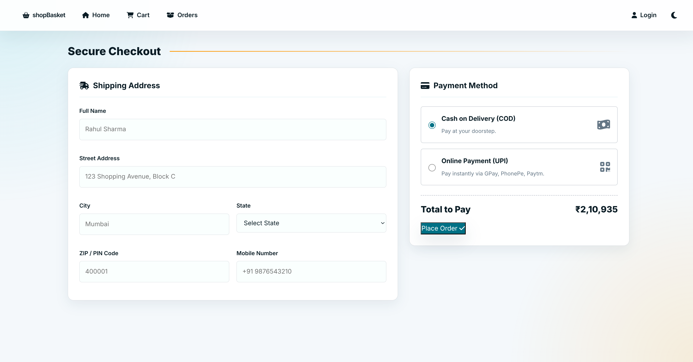
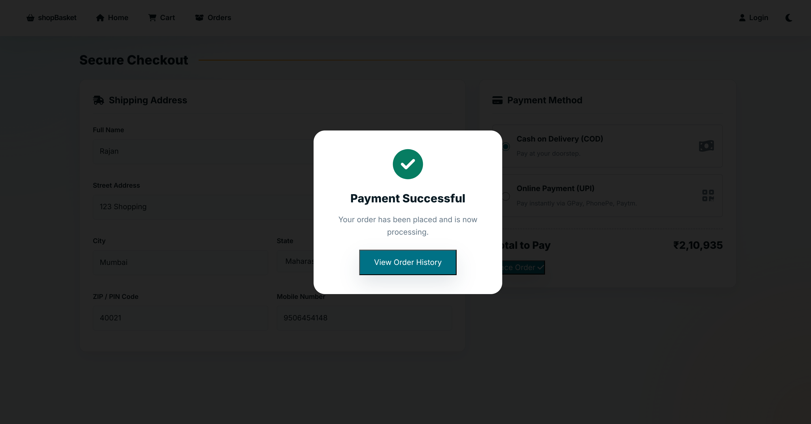
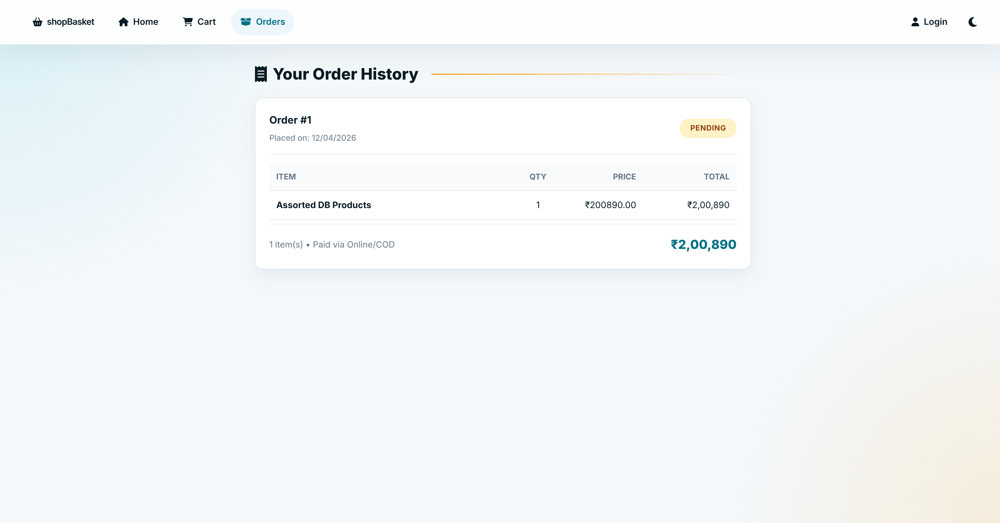

# shopBasket - Electronics E-Commerce Store



A complete full-stack e-commerce application for electronics shopping, built with modern web technologies for a DBMS course project.

## Table of Contents
- [Tech Stack](#tech-stack)
- [Project Structure](#project-structure)
- [Quick Start](#quick-start)
  - [Prerequisites](#prerequisites)
  - [Database Setup](#database-setup)
  - [Running the Application](#running-the-application)
- [Features](#features)
  - [User Management](#user-management)
  - [Product Catalog](#product-catalog)
  - [Shopping Experience](#shopping-experience)
- [Database Structure](#database-structure)
- [Sample Data](#sample-data)
- [API Endpoints](#api-endpoints)
- [UI/UX Design](#uiux-design)
- [Troubleshooting](#troubleshooting)
- [Contributing](#contributing)

## Tech Stack

- **Backend**: Node.js, Express.js, MySQL
- **Frontend**: HTML5, CSS3, JavaScript (Vanilla)
- **Database**: MySQL with relational schema
- **Authentication**: JWT tokens
- **Styling**: Custom CSS with Amazon-inspired design

## Project Structure

```text
shopBasket/
├── database/           # SQL schema, sample data, ER diagram
├── backend/            # Node.js Express API server
│   ├── routes/         # API endpoints (auth, products, cart, orders)
│   ├── config/         # Database configuration
│   └── server.js       # Main server file
├── frontend/           # Client-side application
│   ├── css/           # Stylesheets
│   ├── images/        # Local product images
│   ├── js/            # JavaScript modules
│   └── *.html         # HTML pages
├── screenshots/       # Documentation screenshots
├── setup.sh           # Linux database setup script
├── setup.ps1          # Windows database setup script
├── start.sh           # Mac/Linux complete launcher
└── README.md          # This file
```

## Quick Start

### Prerequisites
- MySQL Server (8.0+) installed and running
- Node.js (14+) installed
- Python 3.x installed (optional, for frontend web server)

### Database Setup

**Option 1: Using shell script (Linux/macOS)**
```bash
./setup.sh
```

**Option 2: Using PowerShell script (Windows)**
```powershell
.\database\setup.ps1
```

**Option 3: Manual SQL Import (All Platforms)**
Run the SQL scripts using your preferred MySQL client (e.g., MySQL Workbench or CLI):
```sql
SOURCE database/schema.sql;
SOURCE database/sample_data.sql;
```

### Running the Application

1. **Start the Backend Server (All Platforms)**
Open a terminal in the `backend` directory:
```bash
cd backend
npm install
npm start
```
*The backend API will run on `http://localhost:3000`.*

2. **Start the Frontend Server (All Platforms)**
Open a **new** terminal in the `frontend` directory:
```bash
cd frontend
# Using Python
python3 -m http.server 8000
# OR Using Node.js
npx serve -p 8000
```
*Then open `http://localhost:8000` in your web browser.*

*Alternatively, if on Linux/macOS, you can use `./start.sh` from the project root to start both servers automatically.*

## Features

### User Management
- User registration and login with JWT authentication
- Profile management
- Password hashing with bcrypt



### Product Catalog
- Electronics product categories: Laptops, Smartphones, Tablets, Headphones, Smartwatches, Gaming
- Filtering by category, price, and ratings
- Customer reviews and ratings
- Product images



### Shopping Experience
- Add to cart functionality
- Real-time cart updates



- Checkout and secure payment process simulation




- Order history and tracking



## Database Structure

Key tables include:
- `Users` - Customer information
- `Products` - Product catalog
- `Categories` - Product categorization
- `Orders` - Order management
- `Order_Items` - Order line items
- `Cart` - Shopping cart
- `Inventory` - Stock management
- `Payments` - Payment processing
- `Reviews` - Customer feedback

## Sample Data

**Test Users:**
- Email: `john@example.com` | Password: `password123`
- Email: `jane@example.com` | Password: `password123`

**Product Categories:** Laptops, Smartphones, Tablets, Headphones, Smartwatches, Gaming

## API Endpoints

### Authentication
- `POST /auth/register` - User registration
- `POST /auth/login` - User login

### Products
- `GET /products` - Get all products with filtering
- `GET /products/:id` - Get product details

### Cart Management
- `POST /cart/add` - Add item to cart
- `GET /cart` - Get user's cart
- `DELETE /cart/remove/:id` - Remove item from cart

### Orders
- `POST /orders` - Place new order
- `GET /orders` - Get user's order history


## Troubleshooting

### Database Connection Issues
```bash
# Check MySQL service
sudo systemctl status mysql
# or on Windows:
Get-Service -Name MySQL*

# Test connection
mysql -u root -p -e "SHOW DATABASES;"

# Reset database
# Re-run the setup script or manual import step
```

### Port Conflicts
If you encounter `EADDRINUSE`:
```bash
# Kill processes on ports 3000/8000 (Linux/macOS)
lsof -ti:3000 | xargs kill -9
lsof -ti:8000 | xargs kill -9

# On Windows
netstat -ano | findstr :3000
taskkill /PID <PID> /F
```

### CORS Issues
- Make sure you access the frontend via `http://localhost:8000` (through the web server started in step 2).
- **Do not** open HTML files directly from the file system (`file:///...`).

## Contributing

1. Fork the repository
2. Create a feature branch
3. Implement changes
4. Test thoroughly
5. Submit a pull request

## Notes

- Sample passwords are not hashed; use bcrypt for production.
- For demo purposes, `address_id` is hardcoded in checkout.
- Admin analytics endpoint `/admin/top-products` requires login.
